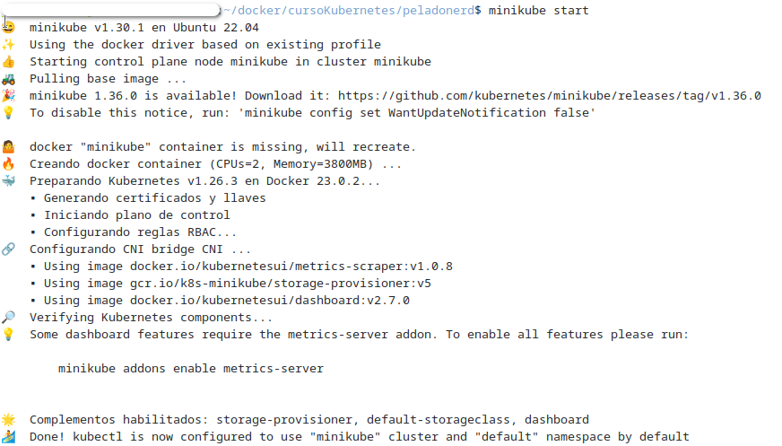
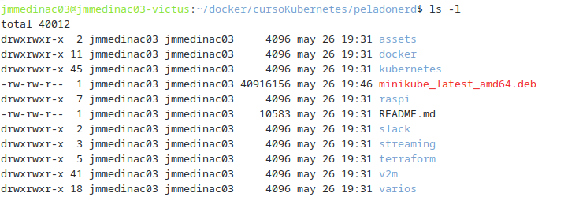
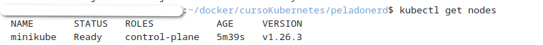
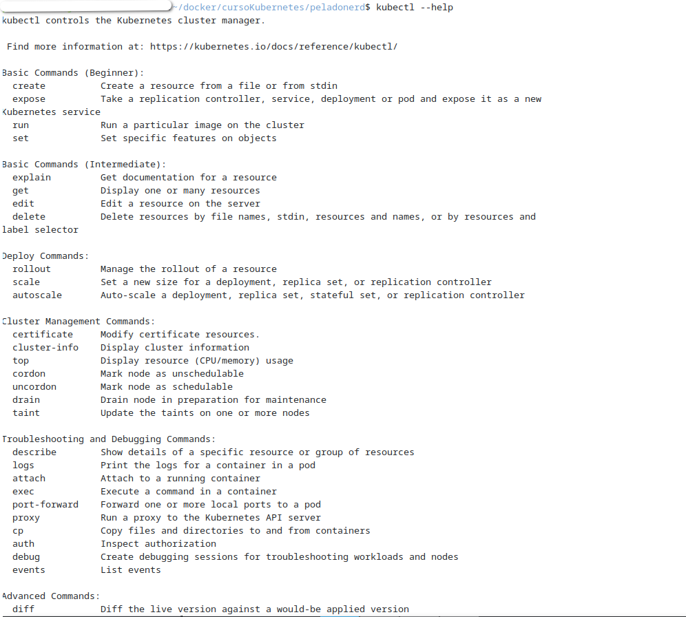
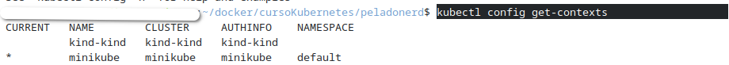
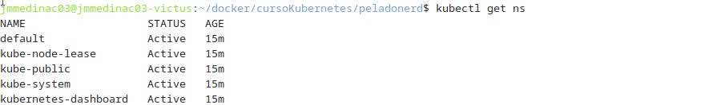
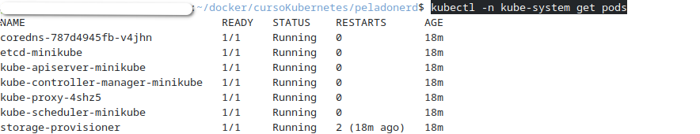
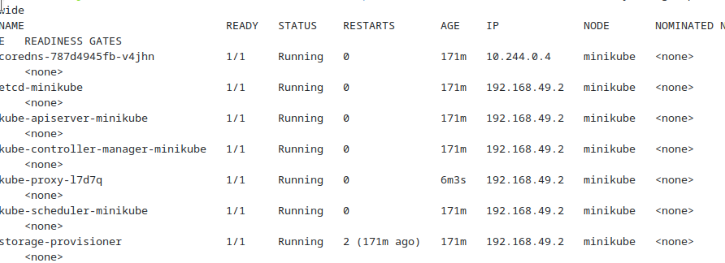
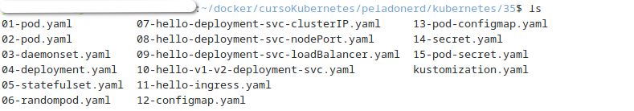
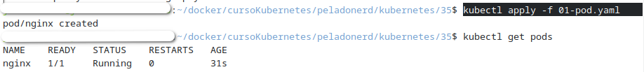

# PPS-IniciacionKubernetes
Siguiendo el vídeo de Pelardo Nard sobre KUBERNETES De NOVATO a PRO!   https://youtu.be/DCoBcpOA7W4


Sigue el vídeo del canal de Pelardo Nard sobre <https://youtu.be/DCoBcpOA7W4>

- Si quieres, puedes clonar el repositorio de peladonerd para poder ver archivos de configuración: 

```bash
git clone https://github.com/pablokbs/peladonerd.git
``` 

- Comprueba si tienes kubectl instalado en tu equipo:

```bash
kubectl version --client=true
``` 

- Instala kubernetes kubectl (si no está instalado)

	- en windows 
		<https://kubernetes.io/es/docs/tasks/tools/included/install-kubectl-windows/>
	- en linux <https://kubernetes.io/es/docs/tasks/tools/included/install-kubectl-linux/> 

- Instalamos también `MiniKube`:
<https://minikube.sigs.k8s.io/docs/start/>

```bash
curl -LO https://storage.googleapis.com/minikube/releases/latest/minikube_latest_amd64.deb
sudo dpkg -i minikube_latest_amd64.deb
``` 

- Iniciamos `MiniKube`
```bash
minikube start
``` 



 Tendrás la siguiente estructura de archivos:



- Comprobamos estructura de nodos creados

```bash
kubectl get nodes
``` 


- Para ver la lista de acciones o comandos posibles:

```bash
kubectl --help
``` 



- Obtnemos configuración.
```bash
kubectl config get-contexts 
``` 



(min 20)

- Obtenemos los namespaces

```bash
kubectl get ns
``` 


- Ver Pods

```bash
kubectl -n kube-system get pods
``` 


```bash
kubectl -n kube-system get pods -o wide
``` 

(min 24:30)
- Borramos un pod, en este caso el pod `proxy`, OJO¡¡¡ que  el número no coincide, pon el que tengas en tu equipo:
```bash
kubectl -n kube-system delete pod kube-proxy-4shz5 
``` 
Vemos como después de unos minutos volvemos a comprobar y se ha recreado un `pod proxy` nuevo:

 En mi caso nos ha creado uno nuevo: `kube-proxy-l7d7q ` 

(min. 26)
Nos cambiamos a la carpeta `kubernetes/35` donde tenemos diferentes archivos de configuraciones.

```bash
cd kubernetes/35
``` 


Para ver la configuración de un manifiesto de pods para `nginx`

archivo `01-pod.yaml`
```bash
cd kubernetes/35
``` 
 Para aplicar el manifiesto y crear el sistema:

```bash
kubectl apply -f 01-pod.yaml
kubectl get pods
``` 



(min 28:55)
- Conectarnos a un terminal interactivo en la máquina nginx
```bash
kubectl exec -it nginx -- sh
´´´ 
 y por ejemplo vemos los procesos que están corriendo en la instancia de `nginx`.
```bash
ps fax
``` 
Para salir `exit`


```bash
```
- Realiza también los apartados de Verificar la configuración y Plugins y configuraciones adiccionales.

- Instalamos Kind para crear los cluster :   https://kind.sigs.k8s.io/docs/user/quick-start/#installing-with-a-package-manager


```bash

``` 

```bash

``` 

```bash

``` 

```bash

``` 

```bash

``` 
```bash

``` 
- Descarga el archivo config.yaml que tienes adjunto. Nos servirá para crear un cluster de 3 nodos.


```bash

``` 

- Crea el cluster con el comando: kind create cluster --config=config.yaml

```bash

``` 

- Iniciamos minikube: minikube start

```bash

``` 
- Creamos cluster de kubernetes con minikube: https://k8s-docs.netlify.app/en/docs/setup/learning-environment/minikube/ (Si tienes problemas para crear el cluster con minikube, puedes utilizar Kind:

```bash

``` 


