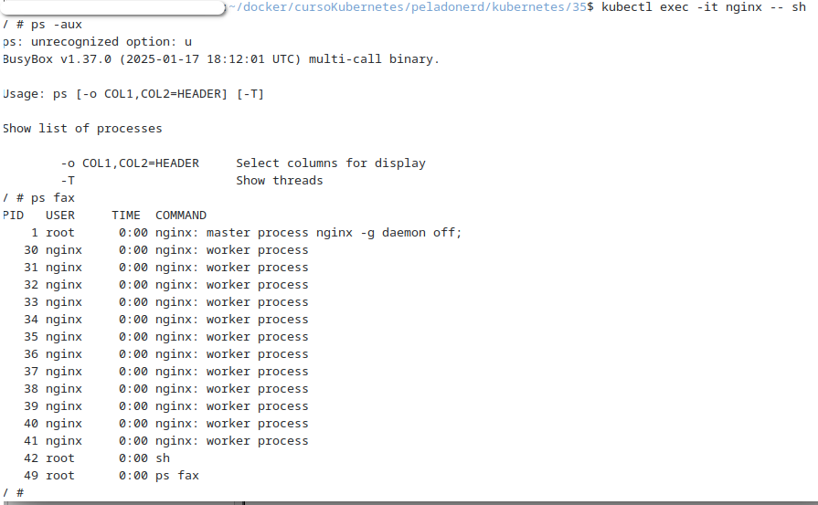
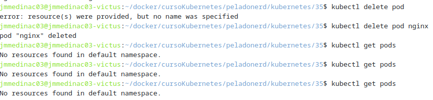
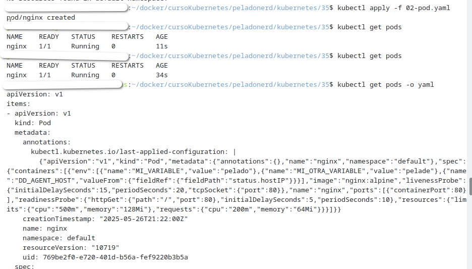
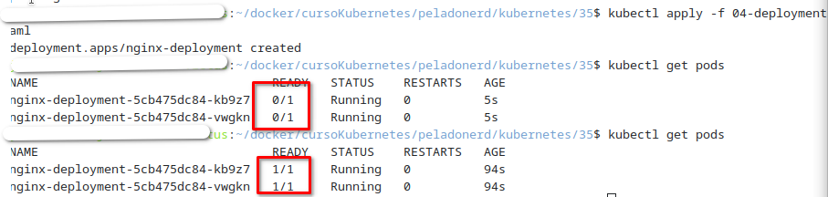
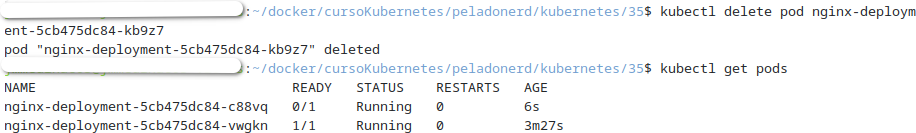
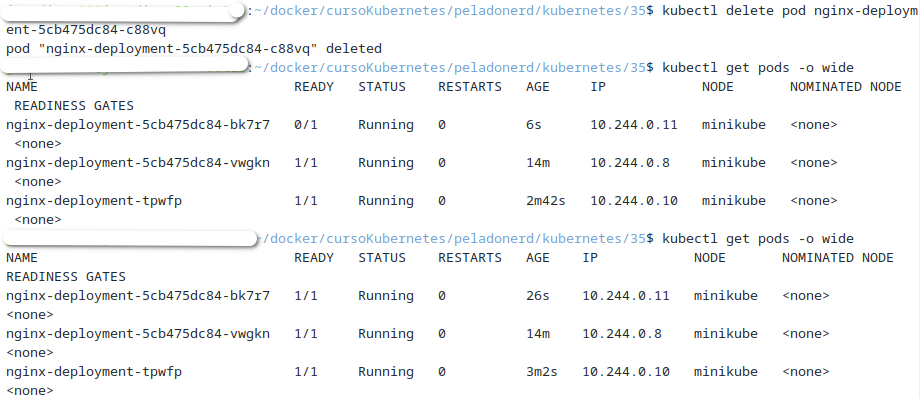
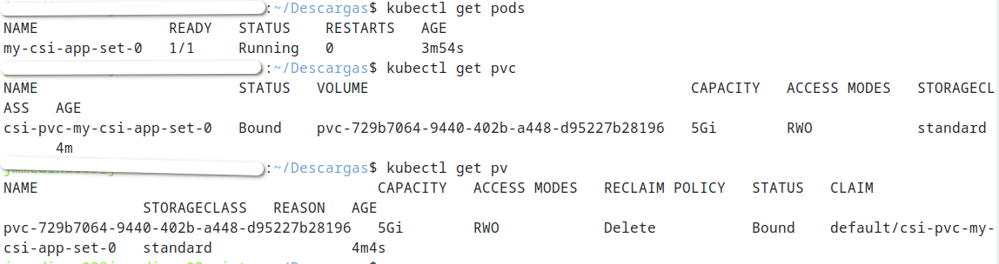

# PPS-IniciacionKubernetes
Siguiendo el vídeo de Pelardo Nard sobre KUBERNETES De NOVATO a PRO!   https://youtu.be/DCoBcpOA7W4


Sigue el vídeo del canal de Pelardo Nard sobre <https://youtu.be/DCoBcpOA7W4>

- Si quieres, puedes clonar el repositorio de peladonerd para poder ver archivos de configuración: 

```bash
git clone https://github.com/pablokbs/peladonerd.git
``` 

- Comprueba si tienes kubectl instalado en tu equipo:

```bash
kubectl version --client=true
``` 

- Instala kubernetes kubectl (si no está instalado)

	- en windows 
		<https://kubernetes.io/es/docs/tasks/tools/included/install-kubectl-windows/>
	- en linux <https://kubernetes.io/es/docs/tasks/tools/included/install-kubectl-linux/> 

- Instalamos también `MiniKube`:
<https://minikube.sigs.k8s.io/docs/start/>

```bash
curl -LO https://storage.googleapis.com/minikube/releases/latest/minikube_latest_amd64.deb
sudo dpkg -i minikube_latest_amd64.deb
``` 

- Iniciamos `MiniKube`
```bash
minikube start
``` 


 Tendrás la siguiente estructura de archivos:


- Comprobamos estructura de nodos creados

```bash
kubectl get nodes
``` 


- Para ver la lista de acciones o comandos posibles:

```bash
kubectl --help
``` 


- Obtnemos configuración.
```bash
kubectl config get-contexts 
``` 


(min 20)

- Obtenemos los namespaces

```bash
kubectl get ns
``` 


- Ver Pods

```bash
kubectl -n kube-system get pods
``` 


```bash
kubectl -n kube-system get pods -o wide
``` 

(min 24:30)
- Borramos un pod, en este caso el pod `proxy`, OJO¡¡¡ que  el número no coincide, pon el que tengas en tu equipo:
```bash
kubectl -n kube-system delete pod kube-proxy-4shz5 
``` 
Vemos como después de unos minutos volvemos a comprobar y se ha recreado un `pod proxy` nuevo:

 En mi caso nos ha creado uno nuevo: `kube-proxy-l7d7q ` 

(min. 26)
Nos cambiamos a la carpeta `kubernetes/35` donde tenemos diferentes archivos de configuraciones.


```bash
cd kubernetes/35
```


Para ver la configuración de un manifiesto de pods para `nginx`

archivo `01-pod.yaml`
```bash
cd kubernetes/35
nano 01-pod.yaml
```

 Para aplicar el manifiesto y crear el sistema:

```bash
kubectl apply -f 01-pod.yaml
kubectl get pods
```


(min 28:55)
- Conectarnos a un terminal interactivo en la máquina nginx
```bash
kubectl exec -it nginx -- s
```
y por ejemplo vemos los procesos que están corriendo en la instancia de `nginx`.

```bash
ps fax
```
Para salir `exit`



-  Comprobamos `pods` que tenemos, matamos proceso y vemos que no se genera de nuevo ya que no hemos creado configuración para ello.

```bash
kubectl get pods
kubectl delet pod nginx
```



(min 30:25)
- Ver configuración de pod02.
archivo `01-pod.yaml`

```bash
nano 02-pod.yaml
```

 Para aplicar el manifiesto y crear el sistema:
```bash
kubectl apply -f 02-pod.yaml
kubectl get pods -o yaml

```


- borrar pods nginx
```bash
kubectl delete pod nginx
```

(min 40:40)

- **Deployment**

vemos el archivo del `deployment`

```bash
nano 04-deployment.yaml
```

```bash
nano 04-deployment.yaml.
kubectl apply -f 04-deployment.yaml.
kubectl get pods 
```
kubectl get pods 
```


```bash
nano 04-deployment.yaml.
kubectl get pods 
```

- Borramos uno de los dos pods, para ver como `kubernetes` lo levanta. ¡¡¡OJO¡¡¡ que el tuyo tiene otro `hash`
```bash
kubectl delete pod nginx-deployment-5cb475dc84-kb9z7 
kubectl get pods 
```



- Borramos el `Deployment`
```bash
kubectl get delete -f 04-deployment.yaml.
```

(min 43:00)

- **Daemon Set**
```bash
nano 03-daemonset.yaml
kubectl apply -f 03-daemonset.yaml
kubectl get pods -o wide `
```
- Borramos uno de los dos pods, para ver como `kubernetes` lo levanta. ¡¡¡OJO¡¡¡ que el tuyo tiene otro `hash`
```bash
kubectl delete pod nginx-deployment-5cb475dc84-kb9z7 
kubectl get pods 
```


```bash
nano 03-daemonset.yaml.
kubectl get pods 
```
- Borramos el `DaemonSet`
```bash
kubectl get delete -f 03-daemonset.yaml.
```
-
(min 46:00)

**State Full Set**

En el tutorial ve los volumenes con el `Template` `StorageClass` de `Digital Ocean` nosotros vamos a utilizar el `storageClass` `standard`.

** Adaptación de StatefulSet para Minikube**

Este documento explica cómo adaptar un `StatefulSet` de Kubernetes diseñado para DigitalOcean a un entorno local usando Minikube.

El archivo original `05-statefulset.yaml` utiliza un `StorageClass` llamado `do-block-storage` que es exclusivo de DigitalOcean, y por tanto no está disponible en Minikube.

Debemos asegurarnos que Minikube tiene el provisioner habilitado para crear volúmenes dinámicamente, por lo que puedes ejecutar este comando para ver qué StorageClass tienes y si tiene un PROVISIONER válido:

```bash
kubectl get storageclass
```
Y luego:

```bash
kubectl describe storageclass standard
```
Deberías ver algo como:

`Provisioner: k8s.io/minikube-hostpath`

Si has intentado ejecutar el `05-statefulset.yaml` debes de borrar el `volumen creado`

```bash
ubectl delete pvc csi-pvc-my-csi-app-set-0 
```
Minikube viene con un `StorageClass` por defecto llamado `standard`, por lo tanto debemos cambiar el `do-block-storage` por `standard`

1. Cambiar el `Storage` en  `05-statefulset.yaml`. Utilizamos el comando de `bash` `sed`.

```bash
sed -i 's/storageClassName: do-block-storage/storageClassName: standard/' 05-statefulset.yaml```

2. Aplica el manifiesto:

```bash
kubectl apply -f 05-statefulset.yaml
```

- Verificar el resultado

Puedes comprobar el estado de los pods y volúmenes con:

```bash
kubectl get pods
kubectl get pvc
kubectl get pv
```


 


```bash
nano 05-statefulset.yaml
kubectl get pods 
```
- 
```bash
kubectl get delete -f 05-statefulset.yaml
```
-
(min 46:00)


```bash
```


```bash
```


- Realiza también los apartados de Verificar la configuración y Plugins y configuraciones adiccionales.

- Instalamos Kind para crear los cluster :   https://kind.sigs.k8s.io/docs/user/quick-start/#installing-with-a-package-manager


```bash

``` 

```bash

``` 

```bash

``` 

```bash

``` 

```bash

``` 
```bash

``` 
- Descarga el archivo config.yaml que tienes adjunto. Nos servirá para crear un cluster de 3 nodos.


```bash

``` 

- Crea el cluster con el comando: kind create cluster --config=config.yaml

```bash

``` 

- Iniciamos minikube: minikube start

```bash

``` 
- Creamos cluster de kubernetes con minikube: https://k8s-docs.netlify.app/en/docs/setup/learning-environment/minikube/ (Si tienes problemas para crear el cluster con minikube, puedes utilizar Kind:

```bash

``` 


